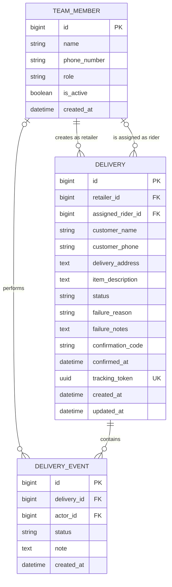

# Reflex

Reflex is a delivery-coordination MVP for small and medium-sized retailers. A retailer creates a delivery request, a dispatcher assigns it to a rider, and the rider records pickup, delivery, or failure. Every lifecycle change is retained as a timestamped audit event.

The backend is built with Django and Django REST Framework. It deliberately does not use login authentication for the MVP. Instead, a user selects an active team member and Django stores that member's ID in the session. The API then applies permissions using the selected member's role.

> Session-based member selection is appropriate for a demonstration, but it does not prove the user's identity. Production use would require authentication.

## Model structure

The data model is defined in `deliveries/models.py` and consists of three related models.



### `TeamMember`

Represents a person who operates Reflex. It is separate from Django authentication and supports three roles:

| Role | Responsibility |
|---|---|
| `RETAILER` | Creates delivery requests and sees deliveries they created. |
| `DISPATCHER` | Sees all deliveries, assigns riders, and sees rider workloads. |
| `RIDER` | Sees and updates only deliveries assigned to them. |

`is_active` controls whether the member can be selected or assigned. `TeamMember` provides the identities needed for delivery ownership, rider assignment, workload calculation, and audit attribution.

### `Delivery`

Stores the current state of a delivery and its customer and package information.

Important relationships:

- `retailer` identifies the retailer who created the request. Deletion is protected.
- `assigned_rider` is initially empty and is populated by a dispatcher. Deletion is protected.
- `tracking_token` is a unique UUID used for the public tracking URL.

Delivery statuses are:

```text
NEW
ASSIGNED
PICKED_UP
DELIVERED
DELIVERY_FAILED
```

Failure reasons are:

```text
CUSTOMER_UNAVAILABLE
WRONG_ADDRESS
PHONE_UNREACHABLE
CUSTOMER_REFUSED
OTHER
```

Model validation ensures that:

- The creator has the `RETAILER` role.
- The assignee has the `RIDER` role.
- Every non-new delivery has an assigned rider.
- A failed delivery has a failure reason.
- The `OTHER` failure reason has explanatory notes.
- A delivered delivery has a confirmation code.

Database constraints additionally prevent a non-new delivery without a rider and prevent failure reasons from being stored on non-failed deliveries. Indexes support status lists and rider workload queries.

### `DeliveryEvent`

Stores the immutable timeline for a delivery. An event contains the delivery, resulting status, optional actor, note, and creation timestamp. Deleting a delivery deletes its events, while deleting an actor referenced by an event is protected.

The current delivery status provides fast access to the present state; the related events preserve how the delivery reached that state.

## Backend structure

The `deliveries` app separates HTTP handling, validation, permissions, and business rules.

| File | Responsibility |
|---|---|
| `models.py` | Database schema, choices, constraints, indexes, and model-level validation. |
| `serializers.py` | JSON representation and request-payload validation. Different operations expose only the fields they need. |
| `permissions.py` | Loads the session-selected member and enforces retailer, dispatcher, or rider access. |
| `services.py` | Implements delivery operations and lifecycle rules inside database transactions. |
| `views.py` | Handles HTTP requests, selects data visible to the current role, and calls serializers and services. |
| `urls.py` | Maps `/api/` routes to views. |
| `admin.py` | Registers the models in Django Admin. |

### Request flow

```text
HTTP request
    -> URL route
    -> permission checks and selected member lookup
    -> serializer input validation
    -> transactional service operation
    -> model validation and database update
    -> audit event creation
    -> serializer response
```

### Session and access control

The client first sends a member ID to `POST /api/session/select-member/`. The server stores it under `team_member_id` in the Django session. The client must retain and resend the session cookie on later requests.

`HasSelectedMember` loads the active member and adds it to the request as `request.team_member`. `IsRetailer`, `IsDispatcher`, and `IsRider` extend that check with role enforcement.

Data visibility is also restricted:

- A retailer sees only deliveries they created.
- A dispatcher sees all deliveries.
- A rider sees only deliveries assigned to them.
- Rider update services verify that the delivery is assigned to the acting rider.

### Delivery lifecycle

The service layer permits these transitions:

```text
NEW -> ASSIGNED -> PICKED_UP -> DELIVERED
                   |              
                   +-----------> DELIVERY_FAILED

ASSIGNED ---------------------> DELIVERY_FAILED
```

Invalid transitions, duplicate assignments, and updates by another rider are rejected. Each service uses `transaction.atomic()` and locks the delivery with `select_for_update()`. Updating the delivery and creating its audit event therefore happen as one operation.

The services are:

- `create_delivery`: creates a `NEW` delivery and creation event.
- `assign_rider`: assigns an active rider and changes `NEW` to `ASSIGNED`.
- `mark_picked_up`: changes the assigned rider's delivery from `ASSIGNED` to `PICKED_UP`.
- `mark_failed`: changes an `ASSIGNED` or `PICKED_UP` delivery to `DELIVERY_FAILED` and records the reason.
- `mark_delivered`: changes `PICKED_UP` to `DELIVERED` and stores the confirmation code and time.

## API documentation

The development base URL is:

```text
http://127.0.0.1:8000/api/
```

Requests and responses use JSON. Except for team-member discovery, member selection, and public tracking, endpoints require the Django session cookie returned during member selection.

### Endpoint summary

| Method | Endpoint | Access | Purpose |
|---|---|---|---|
| `GET` | `/api/team-members/` | Public | List active team members. |
| `POST` | `/api/session/select-member/` | Public | Select the member used for the current session. |
| `GET` | `/api/session/current-member/` | Selected member | Return the currently selected member. |
| `DELETE` | `/api/session/current-member/` | Selected member | Clear the selected member. |
| `GET` | `/api/deliveries/` | Selected member | List deliveries visible to the selected role. |
| `POST` | `/api/deliveries/` | Retailer | Create a delivery request. |
| `GET` | `/api/deliveries/{id}/` | Authorized member | Get a delivery and its timeline. |
| `POST` | `/api/deliveries/{id}/assign/` | Dispatcher | Assign an active rider. |
| `POST` | `/api/deliveries/{id}/pick-up/` | Assigned rider | Mark the delivery as picked up. |
| `POST` | `/api/deliveries/{id}/fail/` | Assigned rider | Mark the delivery as failed. |
| `POST` | `/api/deliveries/{id}/complete/` | Assigned rider | Complete the delivery with proof. |
| `GET` | `/api/riders/workload/` | Dispatcher | List active delivery counts per rider. |
| `GET` | `/api/tracking/{tracking_token}/` | Public | Return customer-safe delivery tracking data. |

### List team members

```http
GET /api/team-members/
```

An optional `role` query parameter filters the result:

```http
GET /api/team-members/?role=RIDER
```

Example response:

```json
[
  {
    "id": 3,
    "name": "Peter",
    "phone_number": "0712345678",
    "role": "RIDER",
    "is_active": true
  }
]
```

### Select a member

```http
POST /api/session/select-member/
Content-Type: application/json
```

```json
{
  "member_id": 3
}
```

The response contains the selected member and sets a session cookie:

```json
{
  "message": "Team member selected.",
  "member": {
    "id": 3,
    "name": "Peter",
    "phone_number": "0712345678",
    "role": "RIDER",
    "is_active": true
  }
}
```

### Read or clear the current member

```http
GET /api/session/current-member/
DELETE /api/session/current-member/
```

`GET` returns the selected member. `DELETE` clears the selection and returns `204 No Content`.

### List deliveries

```http
GET /api/deliveries/
```

The response is automatically filtered according to the selected member's role. An optional `status` filter is supported:

```http
GET /api/deliveries/?status=NEW
```

The response contains customer details, current status, retailer and rider IDs and names, failure information, tracking token, and timestamps.

### Create a delivery

Retailer only.

```http
POST /api/deliveries/
Content-Type: application/json
```

```json
{
  "customer_name": "Jane Doe",
  "customer_phone": "0712345678",
  "delivery_address": "Westlands, Nairobi",
  "item_description": "One box of office supplies"
}
```

The retailer is taken from the session rather than the payload. The API creates the delivery with status `NEW`, generates a tracking token, and creates the first timeline event. A successful request returns `201 Created`.

### Get delivery details

```http
GET /api/deliveries/{id}/
```

The response includes the delivery fields plus an `events` array. Retailers and riders may only access deliveries related to them; dispatchers may access any delivery.

### Assign a rider

Dispatcher only. The delivery must have status `NEW`.

```http
POST /api/deliveries/{id}/assign/
Content-Type: application/json
```

```json
{
  "rider_id": 3
}
```

The selected member must be an active rider. A successful assignment changes the status to `ASSIGNED` and records an event.

### Mark a delivery as picked up

Assigned rider only. The delivery must have status `ASSIGNED`.

```http
POST /api/deliveries/{id}/pick-up/
```

No request body is required. The status becomes `PICKED_UP`.

### Mark a delivery as failed

Assigned rider only. The current status must be `ASSIGNED` or `PICKED_UP`.

```http
POST /api/deliveries/{id}/fail/
Content-Type: application/json
```

```json
{
  "failure_reason": "CUSTOMER_UNAVAILABLE",
  "failure_notes": "Called three times with no response."
}
```

`failure_notes` is optional except when `failure_reason` is `OTHER`. The resulting status is `DELIVERY_FAILED`.

### Complete a delivery

Assigned rider only. The delivery must first have status `PICKED_UP`.

```http
POST /api/deliveries/{id}/complete/
Content-Type: application/json
```

```json
{
  "confirmation_code": "4821"
}
```

The API stores the confirmation code and confirmation time, changes the status to `DELIVERED`, and adds a timeline event.

### View rider workloads

Dispatcher only.

```http
GET /api/riders/workload/
```

Only `ASSIGNED` and `PICKED_UP` deliveries count as active:

```json
[
  {
    "id": 3,
    "name": "Peter",
    "active_deliveries": 2
  }
]
```

### Public tracking

No selected member is required.

```http
GET /api/tracking/{tracking_token}/
```

The response includes the customer name, item description, address, status, assigned rider name, failure information, confirmation time, timestamps, and timeline. It does not expose the customer's phone number or delivery confirmation code.

## Common responses

| Status | Meaning |
|---|---|
| `200 OK` | The read or update succeeded. |
| `201 Created` | A delivery was created. |
| `204 No Content` | The selected member was cleared. |
| `400 Bad Request` | Payload validation or a delivery transition failed. |
| `403 Forbidden` | No member is selected or the selected role cannot perform the action. |
| `404 Not Found` | The member, delivery, or tracking token does not exist. |

Typical validation error:

```json
{
  "non_field_errors": [
    "The delivery must be picked up before it can be delivered."
  ]
}
```

## Running the backend

```bash
source .venv/bin/activate
python manage.py migrate
python manage.py runserver
```

The API is available at `http://127.0.0.1:8000/api/` and Django Admin is available at `http://127.0.0.1:8000/admin/`.
